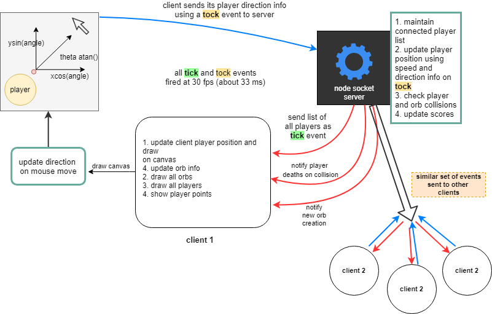

# Agar .io Clone

## App description

Clone of the online agar .io game in Javascript. The multiplayer functionality has been added using websockets in node.js and front end using Canvas.js api for game animations
<br><br>

## App demo


<br><br>

## Run app

### Run server
```bash
npm install
node index.js
```
### Run client by opening ./public/index.html

## Basic overview

The architecture consists of using a **"tick - tock"** scheme of messaging between the client and the server, similar to interacting with the redis server using redis client which uses **"ping-pong"** msgs, using websockets to share realtime player position and other relavant information continously.

The server is what handles are positional calculation for the players based on direction information provided by the client based on mouse direction

The server provides the fps for the game and the rate at which calculations are done, for smoother gameplay the client also maintains communication at the same rate.

At each fps interval the server provides the list of all connected players to each player over the sockets using a **tick** event. Also it runs Orb and player collision codes based on euclidean distance to notify player about scores and deaths with other socket events

The client on receiving this event proceeds to draw all the players and orbs at intervals of the **tock** event which is sent to server containing information about its player's direction

The mouse direction, and players direction is calculated as:
```javascript
const angleDeg = Math.atan2(mousePosition.y - (canvas.height / 2),mousePosition.x - (canvas.width / 2))

player.xVector = (Math.cos(angleDeg)).toFixed(2)
player.yVector = (Math.sin(angleDeg)).toFixed(2)
```

The server updates player position information on **tock** events.
```javascript
updatePos(xVector, yVector) {
    const { worldWidth, worldHeight } = this.settings;
    this.playerConfig.updateDirection(xVector, yVector);
    this.playerData.locX += this.playerConfig.speed * xVector;
    this.playerData.locY += this.playerConfig.speed * yVector;
    ....
    ....
```

One of the optimizations is not passing the entire Orb information on every tick, each player is given complete orb position information at initialization, after which only orb removal and orb creation events are passed to all clients

